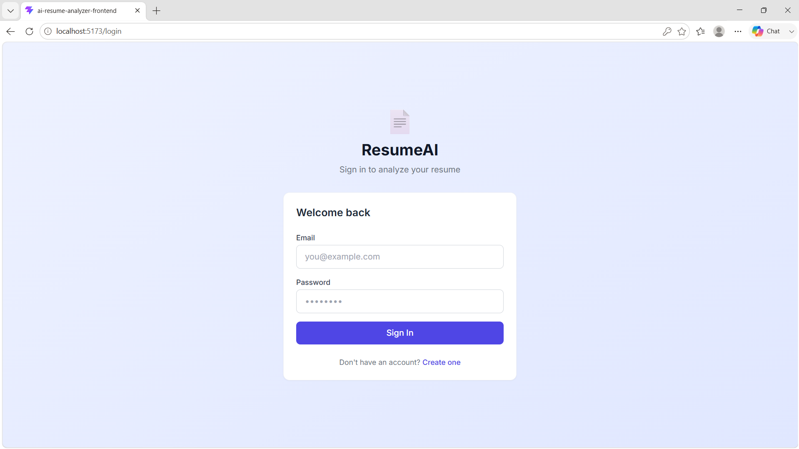
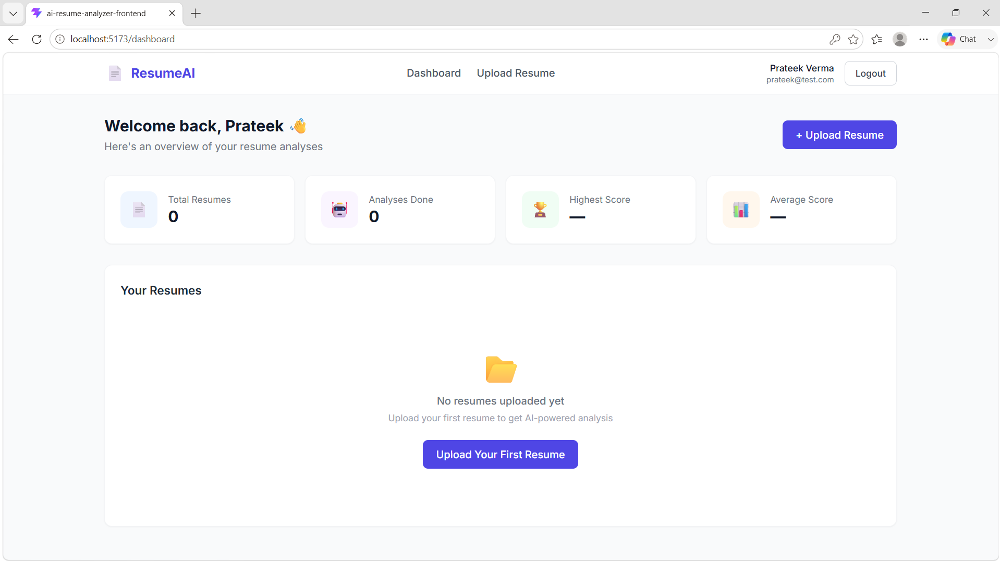
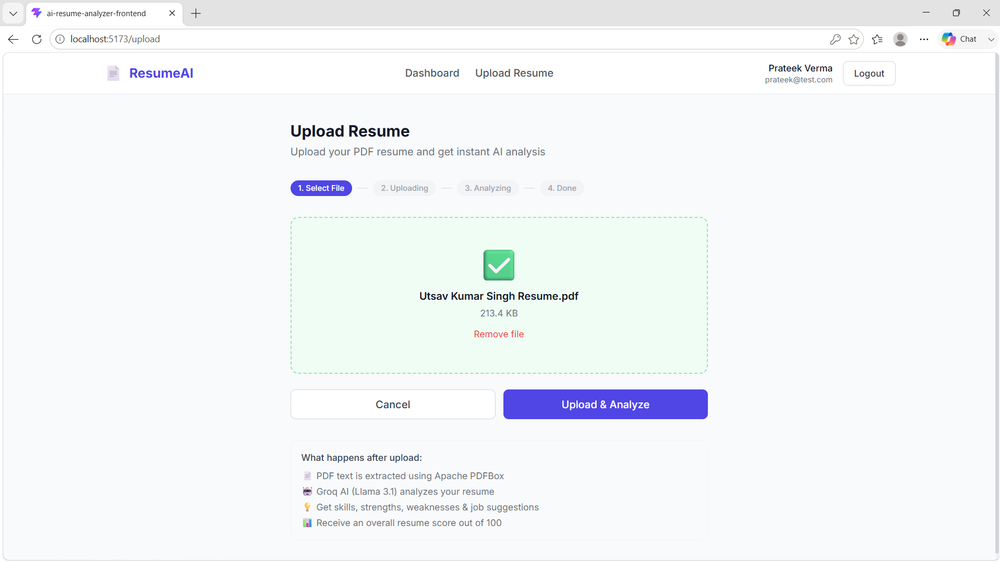
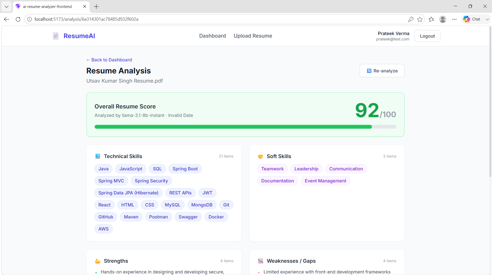
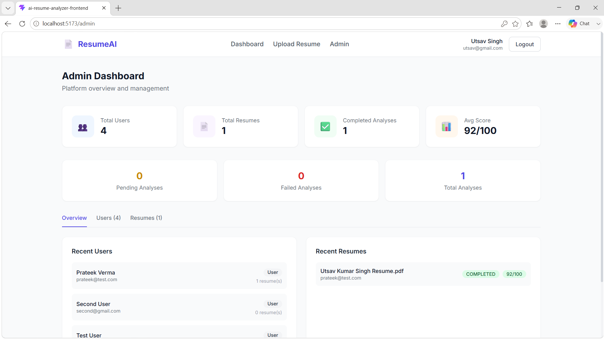

# 🤖 AI Resume Analyzer

A full-stack AI-powered resume analysis application built with **Spring Boot**, **React**, **MongoDB**, and **Groq AI**. Users can upload PDF resumes and receive instant, detailed AI-driven analysis including technical skills, strengths, weaknesses, recommended job roles, and missing skills.

---

## 🌐 Live Demo

**Live Application:** https://ai-resume-analyzer-amber-two.vercel.app

> **Note:** The backend is hosted on Render's free tier. The first request after inactivity may take around 30–60 seconds while the service wakes up.

---

## 📸 Screenshots

| Login Page                 | Dashboard                      |
| -------------------------- | ------------------------------ |
|  |  |

| Upload Resume               | Analysis Results              |
| --------------------------- | ----------------------------- |
|  |  |

| Admin Dashboard                      |
| ------------------------------------ |
|  |

---

## ✨ Features

### User Features
- 🔐 Secure registration and login with JWT authentication
- 📄 PDF resume upload with drag-and-drop support
- 🤖 AI-powered resume analysis using Groq (GPT-OSS 20B)
- 💡 Extracts technical skills, soft skills, strengths, weaknesses
- 🎯 Suggests suitable job roles based on resume content
- ➕ Identifies missing skills to improve hirability
- 📊 Overall resume score out of 100
- 🔄 Re-analyze any resume at any time
- 📋 Personal dashboard with analysis history and stats
- 🗑️ Delete own resumes and associated analyses

### Admin Features
- 👥 View and manage all registered users
- 📁 View all uploaded resumes across the platform
- 📊 Platform-wide statistics dashboard
- 🗑️ Delete any user or resume with cascading cleanup

---

## 🛠️ Tech Stack

| Layer | Technology |
|-------|-----------|
| **Frontend** | React 18, Vite, Tailwind CSS, Axios, React Router v6 |
| **Backend** | Java 21, Spring Boot 3.5.x, Spring Security 6, JWT |
| **Database** | MongoDB 7.x with Spring Data MongoDB |
| **AI** | Groq API (GPT-OSS 20B) |
| **PDF Parsing** | Apache PDFBox 3.0.1 |
| **Auth** | JWT (JJWT 0.12.3), BCrypt password hashing |
| **Build** | Maven 3.9.x, Node.js 20 LTS |

---

## 📁 Project Structure

```
ai-resume-analyzer/
├── ai-resume-analyzer-backend/          # Spring Boot application
│   ├── src/main/java/com/resumeanalyzer/
│   │   ├── config/                      # Security, MongoDB, CORS, Groq config
│   │   ├── controller/                  # Auth, Resume, Analysis, Admin, Dashboard
│   │   ├── service/                     # Business logic layer
│   │   ├── repository/                  # MongoDB repositories
│   │   ├── model/                       # User, Resume, ResumeAnalysis
│   │   ├── dto/                         # Request/Response DTOs + Groq DTOs
│   │   ├── exception/                   # Global exception handler
│   │   ├── security/                    # JWT filter, entry points
│   │   └── util/                        # JWT, Security utilities
│   ├── src/main/resources/
│   │   └── application.properties
│   └── uploads/                         # PDF storage (gitignored)
│
└── ai-resume-analyzer-frontend/         # React application
    └── src/
        ├── api/                         # Axios API modules
        ├── context/                     # Auth context
        ├── components/                  # Reusable UI components
        └── pages/                       # Login, Register, Dashboard, Upload, Analysis, Admin
```

---

## 🗄️ Database Design

### Collections

**`users`**
```json
{
  "_id": "ObjectId",
  "name": "string",
  "email": "string (unique indexed)",
  "password": "bcrypt hash",
  "role": "ROLE_USER | ROLE_ADMIN",
  "createdAt": "timestamp",
  "updatedAt": "timestamp"
}
```

**`resumes`**
```json
{
  "_id": "ObjectId",
  "userId": "ref → users._id (indexed)",
  "fileName": "string",
  "fileStoragePath": "string",
  "fileSize": "number",
  "resumeText": "string (extracted by PDFBox)",
  "analysisStatus": "PENDING | PROCESSING | COMPLETED | FAILED | PARSE_FAILED",
  "analysisId": "ref → resume_analyses._id",
  "uploadedAt": "timestamp"
}
```

**`resume_analyses`**
```json
{
  "_id": "ObjectId",
  "resumeId": "ref → resumes._id (unique indexed)",
  "userId": "ref → users._id (indexed)",
  "technicalSkills": ["string"],
  "softSkills": ["string"],
  "strengths": ["string"],
  "weaknesses": ["string"],
  "recommendedRoles": ["string"],
  "missingSkills": ["string"],
  "overallScore": "integer (0–100)",
  "groqModelUsed": "string",
  "analyzedAt": "timestamp"
}
```

---

## 🔌 API Reference

### Public Endpoints

| Method | Endpoint | Description |
|--------|----------|-------------|
| POST | `/api/auth/register` | Register a new user |
| POST | `/api/auth/login` | Login and receive JWT token |

### User Endpoints (Requires JWT)

| Method | Endpoint | Description |
|--------|----------|-------------|
| GET | `/api/user/dashboard` | Full dashboard: profile + resumes + stats |
| GET | `/api/user/profile` | Current user profile |
| POST | `/api/resume/upload` | Upload a PDF resume |
| GET | `/api/resume/my-resumes` | List own resumes |
| GET | `/api/resume/{id}` | Get resume by ID |
| DELETE | `/api/resume/{id}` | Delete own resume |
| GET | `/api/resume/{id}/text-preview` | Preview extracted text |
| POST | `/api/analysis/analyze/{resumeId}` | Trigger AI analysis |
| POST | `/api/analysis/re-analyze/{resumeId}` | Force re-analysis |
| GET | `/api/analysis/resume/{resumeId}` | Get analysis result |
| GET | `/api/analysis/my-analyses` | List all own analyses |

### Admin Endpoints (Requires ROLE_ADMIN)

| Method | Endpoint | Description |
|--------|----------|-------------|
| GET | `/api/admin/dashboard` | Platform stats + recent activity |
| GET | `/api/admin/users` | List all users |
| GET | `/api/admin/users/{userId}` | Get user details |
| DELETE | `/api/admin/users/{userId}` | Delete user + all their data |
| GET | `/api/admin/resumes` | List all resumes |
| GET | `/api/admin/users/{userId}/resumes` | Get resumes by user |
| DELETE | `/api/admin/resume/{resumeId}` | Delete any resume |
| GET | `/api/admin/resume/{resumeId}/analysis` | Get analysis for any resume |

---

## 🚀 Getting Started

### Prerequisites

| Tool | Version | Download |
|------|---------|----------|
| Java | 21 (LTS) | https://adoptium.net |
| Maven | 3.9.x | https://maven.apache.org |
| Node.js | 20 (LTS) | https://nodejs.org |
| MongoDB | 7.x | https://www.mongodb.com/try/download/community |
| Git | Latest | https://git-scm.com |

You also need a **free Groq API key** from https://console.groq.com

---

### Backend Setup

**1. Clone the repository**
```bash
git clone https://github.com/utsav7978/ai-resume-analyzer.git
cd ai-resume-analyzer/ai-resume-analyzer-backend
```

**2. Set the Groq API key as a system environment variable**

On Windows (PowerShell — run once, then restart terminal):
```powershell
setx GROQ_API_KEY "your_actual_groq_api_key_here"
```

On macOS/Linux:
```bash
export GROQ_API_KEY="your_actual_groq_api_key_here"
# Add to ~/.bashrc or ~/.zshrc for persistence
```

**3. Verify `application.properties`**

The file at `src/main/resources/application.properties` should contain:
```properties
app.groq.api-key=${GROQ_API_KEY}
app.groq.model=openai/gpt-oss-20b
```

No hardcoded keys — the environment variable is read automatically at startup.

**4. Start MongoDB**
```bash
mongod
```

**5. Run the backend**
```bash
mvn spring-boot:run
```

Backend starts at `http://localhost:8080`

---

### Frontend Setup

```bash
cd ../ai-resume-analyzer-frontend
npm install
npm run dev
```

Frontend starts at `http://localhost:5173`

---

### Creating an Admin User

All new registrations default to `ROLE_USER`. To promote a user to admin:

1. Open **MongoDB Compass** → connect to `mongodb://localhost:27017`
2. Open `ai_resume_analyzer` → `users` collection
3. Find your user document
4. Edit the `role` field: change `"ROLE_USER"` → `"ROLE_ADMIN"`
5. Click **Update**
6. Log in again to receive a JWT with the admin role

---

## 🔒 Security Implementation

- **Password hashing** — BCrypt with strength factor 12
- **JWT authentication** — signed with HMAC-SHA256, 24-hour expiration
- **Role-based access** — `@PreAuthorize` + `SecurityFilterChain` double layer
- **Stateless sessions** — no server-side session storage
- **CORS** — configured to allow only `http://localhost:5173`
- **Ownership validation** — users can only access their own resumes
- **API key protection** — Groq key stored as OS environment variable, never in code

---

## 🤖 AI Analysis Details

**Model:** `GPT-OSS 20B` via Groq API

**What the AI extracts from your resume:**

| Field | Description |
|-------|-------------|
| Technical Skills | Programming languages, frameworks, tools, databases |
| Soft Skills | Communication, teamwork, leadership, etc. |
| Strengths | Specific strong areas based on resume content |
| Weaknesses | Skill gaps and areas needing improvement |
| Recommended Roles | 4–6 job titles the candidate is best suited for |
| Missing Skills | Skills that would significantly improve hirability |
| Overall Score | 0–100 rating of resume quality and candidate strength |

**PDF Text Extraction:** Apache PDFBox 3.0.1
- Maintains reading order (`setSortByPosition(true)`)
- Detects and rejects encrypted PDFs
- Detects scanned/image-only PDFs (marks as `PARSE_FAILED`)
- Truncates to 10,000 characters to stay within AI token limits
- Cleans extracted text: normalizes whitespace, removes non-printable characters

---

## ⚙️ Configuration Reference

All backend configuration lives in `src/main/resources/application.properties`:

```properties
# Server
server.port=8080

# MongoDB
spring.data.mongodb.host=localhost
spring.data.mongodb.port=27017
spring.data.mongodb.database=ai_resume_analyzer

# JWT
app.jwt.secret=your_256_bit_hex_secret
app.jwt.expiration=86400000        # 24 hours in milliseconds

# File Upload
app.file.upload-dir=uploads/resumes
spring.servlet.multipart.max-file-size=5MB
spring.servlet.multipart.resolve-lazily=true

# Groq AI
app.groq.api-key=${GROQ_API_KEY}   # Set as OS environment variable
app.groq.api-url=https://api.groq.com/openai/v1/chat/completions
app.groq.model=openai/gpt-oss-20b
```

---

## 🐛 Known Issues & Solutions

| Issue | Cause | Fix |
|-------|-------|-----|
| `Could not resolve placeholder 'GROQ_API_KEY'` | Spring Boot does not auto-read `.env` files | Set `GROQ_API_KEY` as OS environment variable via `setx` (Windows) or `export` (Linux/Mac) |
| Git push blocked (secret detected) | API key committed directly in `application.properties` | Use `${GROQ_API_KEY}` placeholder; add `.env` to `.gitignore` |
| Non-PDF upload returns 500 instead of 400 | Spring multipart handler intercepts before validation | Add `spring.servlet.multipart.resolve-lazily=true` to `application.properties` |
| ROLE_USER gets 401 instead of 403 on admin routes | Spring Security's default error handling conflicts | Add `JwtAccessDeniedHandler` registered in `SecurityConfig` |
| Groq model `llama3-8b-8192` returns error | Model decommissioned by Groq | Replaced with `GPT-OSS 20B` |

---

## 🔮 Future Improvements

- [ ] Mobile-responsive Navbar with hamburger menu
- [ ] Email verification on registration
- [ ] Password reset flow
- [ ] Resume comparison (side-by-side analysis)
- [ ] Export analysis results as PDF report
- [ ] Support for DOCX resume format
- [ ] Pagination on admin tables
- [ ] Rate limiting on upload and analysis endpoints
- [ ] Docker + Docker Compose setup for one-command deployment
- [ ] Unit and integration test suite (JUnit 5 + Mockito)
- [ ] CI/CD pipeline with GitHub Actions

---

## 📚 Development Phases

This project was built across 14 structured phases:

| Phase | Description |
|-------|-------------|
| 1 | Project architecture, folder structure, MongoDB design |
| 2 | Spring Boot setup, dependencies, configuration |
| 3 | MongoDB integration, data models, repositories |
| 4 | JWT authentication — register, login, token generation |
| 5 | Role-based authorization — ROLE_USER vs ROLE_ADMIN |
| 6 | Resume upload module — PDF validation, local storage |
| 7 | PDF parsing — Apache PDFBox text extraction |
| 8 | Groq AI integration — prompt engineering, JSON parsing |
| 9 | User dashboard APIs — profile, resumes, analyses, stats |
| 10 | Admin dashboard APIs — user/resume management, platform stats |
| 11 | React frontend setup — Vite, Tailwind, Axios, routing |
| 12 | Full UI implementation — all 6 pages |
| 13 | End-to-end testing |
| 14 | README documentation |

---

## 👨‍💻 Author

**Utsav Kumar Singh**

Built as a portfolio project demonstrating full-stack development with Java Spring Boot, React, MongoDB, and AI API integration.

🌐 Live Demo: https://ai-resume-analyzer-amber-two.vercel.app

- GitHub: [utsav7978](https://github.com/utsav7978)
- LinkedIn: [Utsav Kumar Singh](https://www.linkedin.com/in/utsav-kumar-singh/)
